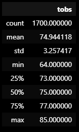
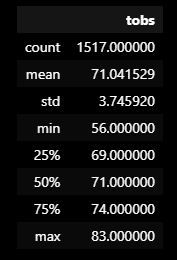

# surfs_up

## Purpose of Project:
The purpose of this project was to do a basic weather analysis of some weather data from Hawaii to determine the feasability of opening a 'Surf 'n Icecream" shop on the island.  The data was given in the form of an SQLite data file and opened and interpreted using Python code along with the SQLAlchemy dependency.

# Results:
Please see the screenshots below of the temp data.
- The mean and median temperature difference between June and December is approximately 4 degrees.
- The temperature in December is slightly more variable as seen in the difference in the standard deviations.  3.26 in June versus 3.75 in December.
- The final major difference in temperature between the months is seen in their extrema.  June has a minimum of 64 compared to 56 in December.  The difference in maximums is not as prounounced as June has a max of 85 compared to 83 in December.

## June Temp Statistics Summary:

## December Temp Statistics Summary:

# Summary:
Based upon the temperature data during the months of June and December it does appear that a 'Surf 'n Icecream' shop could do well on the island.  However, before leaping into such a decision I believe that some additional queries may provide additional information.
- What are the average temperatures like during July/August, which is typically the hottest 2 months of the year in the US.  What about the average temperature during the coldest months of the year January and Febuary?  After all, wouldn't we like our store to run 365 days a year for maximum revenue?
- I also believe that looking more closely at the precipitation data could be useful.  For instance, are there any momths where all it seemingly does is rain?  That would be bad for business!  To that end, I think a side by side comparison with average temperature and average precipation would be great to look at on a month to month basis.

With just a little bit more analysis, I think we can get a better picture of the feasibility of the store.  I can almost feel the surf and taste the icecream!
